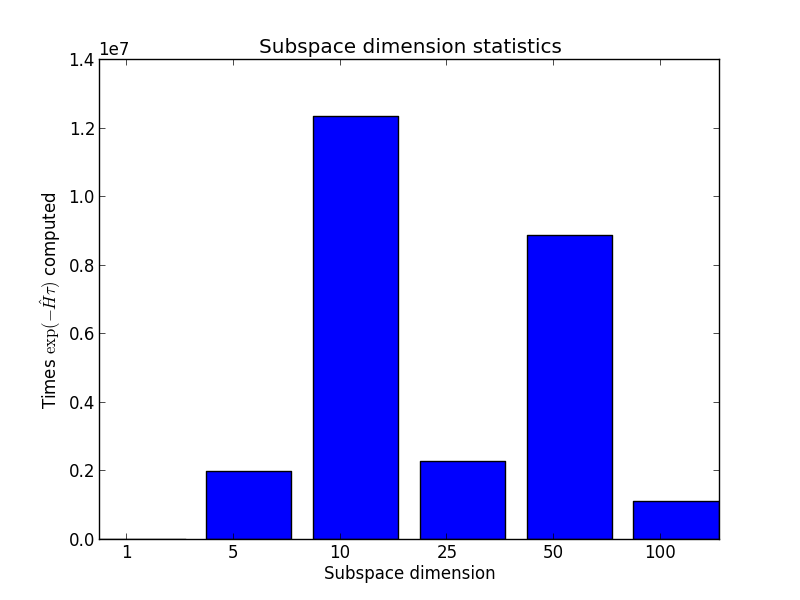

Benchmarks
==========

To benchmark the solver, we studied a 5-band "Kanamori" Hamiltonian for various fillings and temperatures.

Parameters of the bath and local atomic levels are shown in the table below:

+--------------------+----------------+----------------+-----------------+----------------+---------------------+
|                    | :math:`d_{xy}` | :math:`d_{yz}` | :math:`d_{z^2}` | :math:`d_{xz}` | :math:`d_{x^2-y^2}` |
+====================+================+================+=================+================+=====================+
| :math:`V`          | 0.2            | 0.2            | 0.2             | 0.2            | 0.2                 |
+--------------------+----------------+----------------+-----------------+----------------+---------------------+
| :math:`\epsilon_k` | -0.2           | -0.15          | -0.1            | 0.05           | 0.4                 |
+--------------------+----------------+----------------+-----------------+----------------+---------------------+
| :math:`\epsilon_d` | -0.2           | -0.15          | -0.1            | 0.05           | 0.4                 |
+--------------------+----------------+----------------+-----------------+----------------+---------------------+

U = 5.0
J = 0.1
half_bandwidth = 1.0
mu = 40.0 for approximately 1 electron
mu = 21.5 for 5 electrons (analytical result)
n_warmup_cycles=10000
length_cycle=500
n_cycles=100000

quantum numbers :math:`N_{\uparrow}` and :math:`N_{\downarrow}`

5-band results
--------------

Here must be a plot of a :math:`G(\tau)`. But it is still too noisy. Such a shame...

Histogram of subspace dimensions
--------------------------------

A typical distribution of subspace dimensions in one "5+5" run.

This histogram is produced for

- ``length_cycle = 500``
- ``n_warmup_cycles = 10000``
- ``n_cycles = 100000``

The hybrid mode
---------------

- "5+5" test, quantum numbers :math:`N_{\uparrow}` and :math:`N_{\downarrow}`

+------------------------------+--------------------------+
|                              |                          |
+==============================+==========================+
| 100                          | 591                      |
+------------------------------+--------------------------+
| 50                           | 999                      |
+------------------------------+--------------------------+
| 25                           | 2450                     |
+------------------------------+--------------------------+
| 10                           | 2559                     |
+------------------------------+--------------------------+
| 5                            | 2666                     |
+------------------------------+--------------------------+
| 1                            | 2660                     |
+------------------------------+--------------------------+
| 0                            | 2668                     |
+------------------------------+--------------------------+
      
