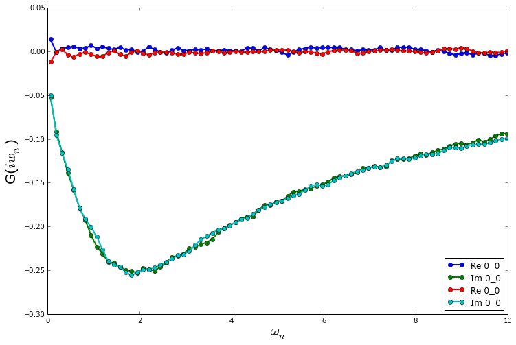

.. _random:

Random number generators
=========================

It is possible (and highly recommended!) to use different random number
generators with the CTQMC solver. A list of available random generators can be
obtained with::

  from triqs.random_generator import *
  print random_generator_names_list()

The names in this list can then be used to set the ``random_name`` keyword
argument in the ``solve()`` method of the CTQMC solver. Here is an example where
the same run is done twice, but using different random generators.

.. literalinclude:: several_random.py

The resulting Green's functions are:
  

As one can see from the plots, the two random number generators lead to very
similar results.  On these short runs, one also notices that more statistics
will be needed to have a reliable Green's function at low frequencies.
